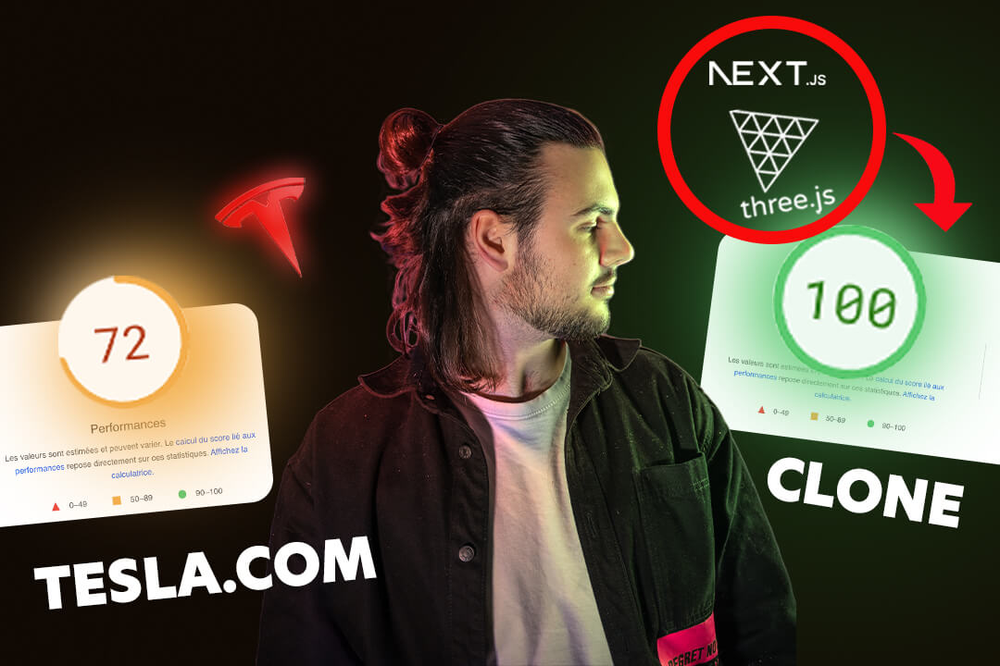
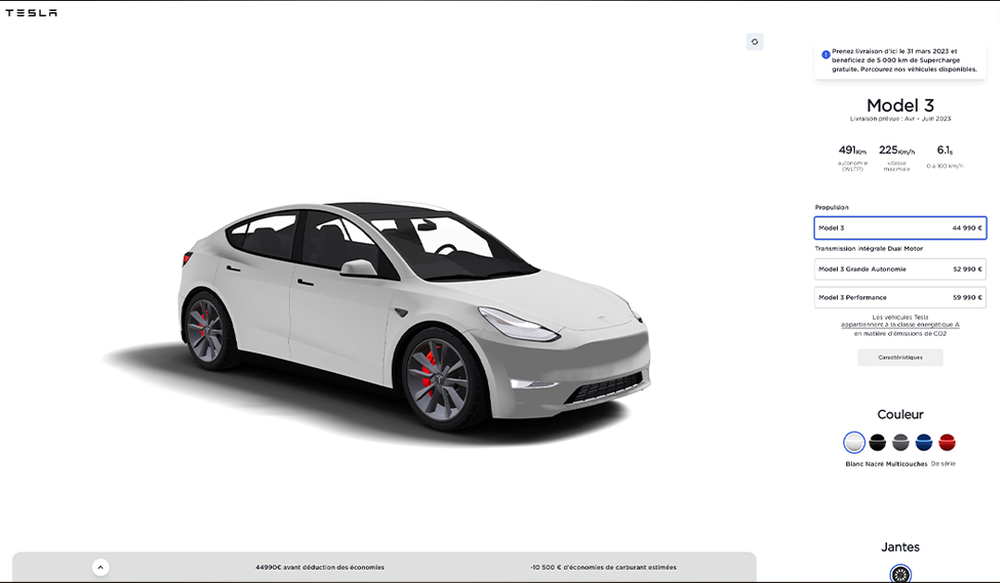
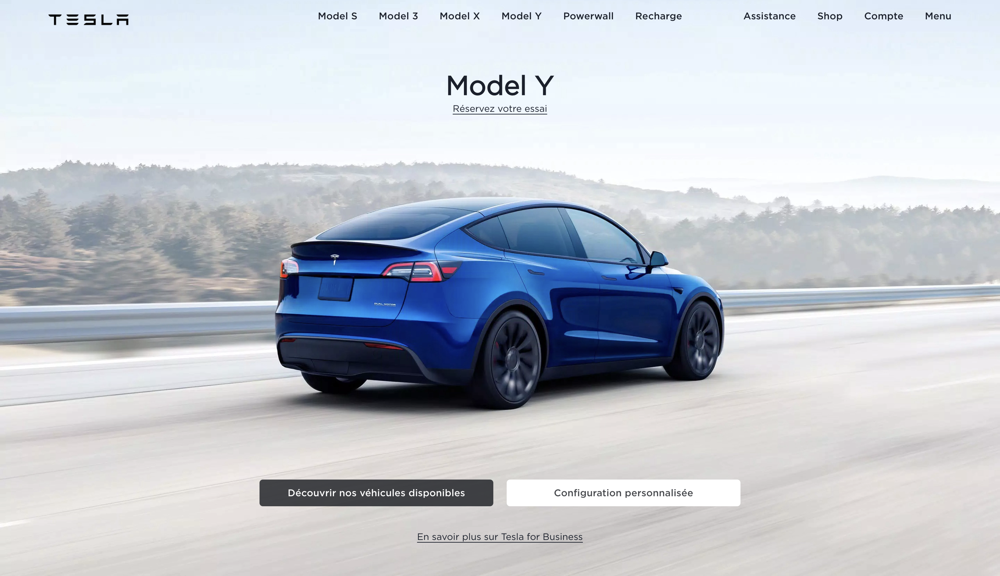

# Tesla Clone App avec Next.js 13 et React Three Fiber

Bienvenue sur le dépôt de [Tesla Clone](https://clone-tesla-delta.vercel.app/),
une réplique du site officiel de Tesla, développée avec **Next.js 13** et
**React Three Fiber** pour une expérience de
[configurateur 3D unique](https://clone-tesla-delta.vercel.app/configurateur).
Cette application inclut toutes les fonctionnalités, animations et pages du site
original, en y ajoutant une touche personnelle grâce à l'intégration de Three.js
et React Three Fiber.

<div>
  
  <div>    </div>

</div>

## 🚀 Fonctionnalités

- Clone fidèle du site officiel de Tesla
- Mise en œuvre des dernières technologies : Next.js 13 et React 18
- Configurateur 3D interactif avec React Three Fiber et Three.js
- Toutes les pages et animations du site original
- Optimisations pour le référencement (SEO)
- Responsive design pour une expérience utilisateur optimale sur tous les
  appareils

## 📦 Installation

1. Clonez ce dépôt :

```bash
git clone https://github.com/AndreaGauvreau/clone-tesla.git
```

Ouvrez votre navigateur et accédez à http://localhost:3000. L'application sera
automatiquement chargée et prête à être utilisée.

2. Accédez au dossier du projet et installez les dépendances

```
cd tesla-clone
npm install
```

3. Lancez l'application en mode développement :

```
npm run dev
```

🌐 Déploiement Suivez les instructions de déploiement de Next.js pour déployer
votre application sur la plateforme de votre choix (Vercel, Netlify, etc.).

🙌 Remerciements Un grand merci à Tesla pour leur site Web inspirant et à tous
les développeurs qui ont contribué à l'écosystème Next.js et React.
